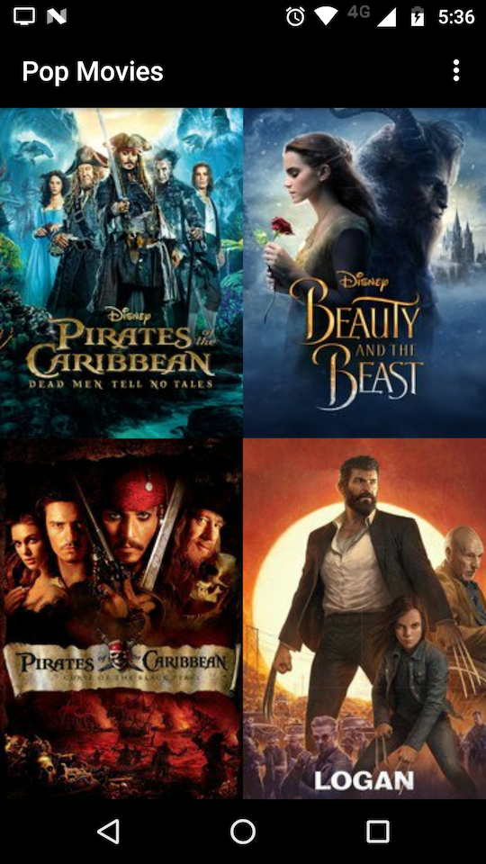
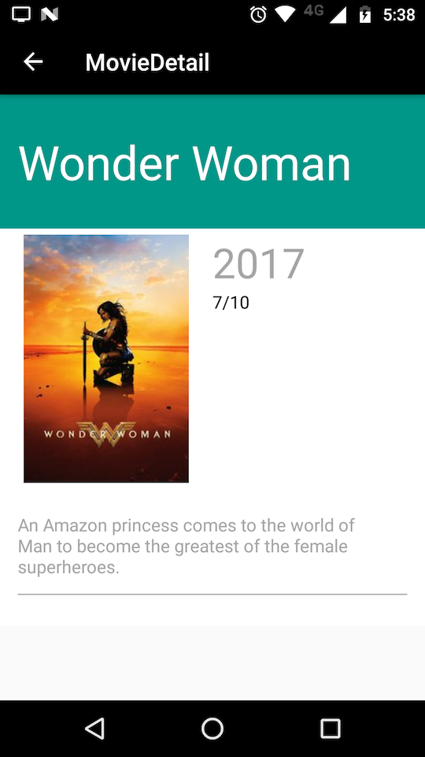

<h1 align="center">
   
  
   
  Hypermnesia
   
   
</h1>

<h4 align="center">An Android Movie Guide App</h4>

### Running

This project was built using Android Studio 2.3.2 and Gradle 3.3 
All dependencies are listed at build.gradle.

In order to run this application you'll need to have a 
[MovieDB API Key](https://www.themoviedb.org/documentation/api). Once you get one,
you'll need to put it into configs.xml - inside res/values. There's a comment indicating
the right place to insert your key.

### Screenshots

| Main | Movie Detail |
|---|---|
|  |  |

### Credits

Cinepedia logo was created by [Dimi Kazak](http://www.flaticon.com/authors/dimi-kazak/), released
under [Flaticon Basic License](http://file000.flaticon.com/downloads/license/license.pdf) license.
